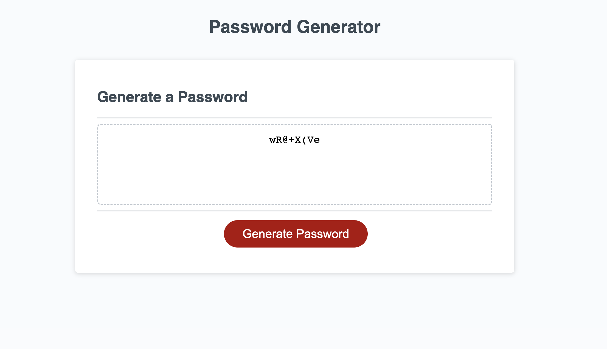

# JavaScript-Password

## Description

The purpose of this project was to create a radomized password generator, using javascript, to keep user data protected. While working on this homework I learned basic javascript functions, and got a better understanding on the javascript basic language. 

## Installation

N/A

## Usage

To use this web app you will first click on the "generate password button", then 5 prompts will appear, make sure to press "okay" on all the prompts and then a random password will be generated in the card.

## License

MIT License: For more information, please refer to the license listed in the repository

